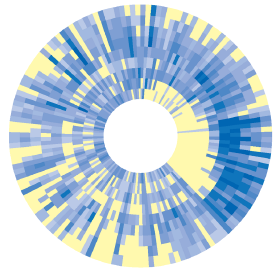
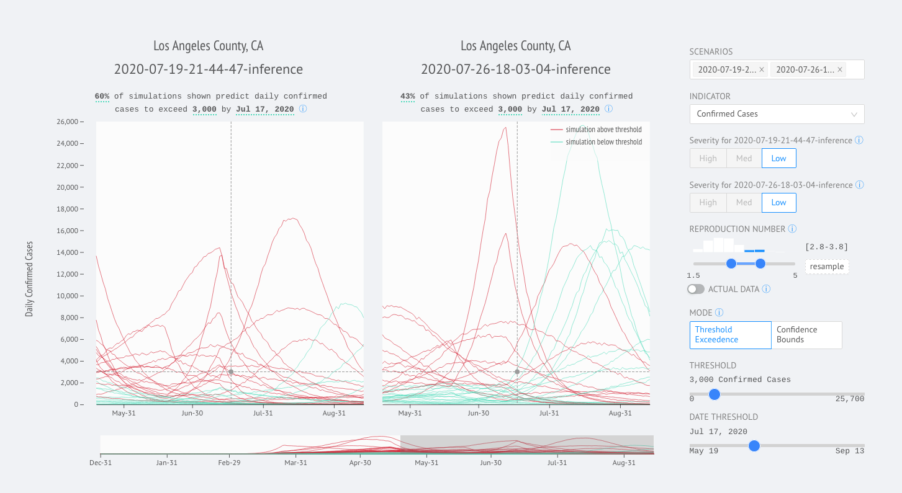

 [](https://www.gnu.org/licenses/gpl-3.0)
 
This is the code repository for [www.iddynamics.jhsph.edu/covid/dashboard](https://www.iddynamics.jhsph.edu/covid/dashboard), an interactive tool for visualizing COVID-19 intervention scenario models produced by the Johns Hopkins University's Infectious Disease Dynamics Working Group ([IDD Working Group](www.iddynamics.jhsph.edu/)) in support of the COVID-19 operational response of federal and state agencies.

Public health decision makers look to epidemiological models for decision support in allocating resources, developing non-pharmaceutical interventions, and characterizing the dynamics of COVID-19 in their jurisdictions. In response, the IDD Working Group developed a flexible scenario modeling pipeline that could quickly tailor models for decision makers seeking to compare projections of epidemic trajectories and healthcare impacts from multiple intervention scenarios in different locations. This interactive tool visualizes those models to expedite data exploration and decision making for municipal emergency response.




## Summary

- [Getting Started](#getting-started)
- [Deployment](#deployment)
- [Bugs and Feature Requests](#bugs-and-feature-requests)
- [Troubleshooting](#troubleshooting)
- [Future Work](#future-work)
- [License](#license)

## Getting Started

#### Prerequisites
npm >= 10.22.0

#### Development

If you would like to contribute to this project, set up your local development environment like so:

```shell

# install node dependencies
$ npm init

# spin up local dev server
$ npm start
```

#### Testing with local data files

Currently the data files are being fetched from the IDD Working Group's s3 bucket `idd-dashboard-runs`. However, if you would like to test your own data files or change the data format for testing, drop the new data files into the `store` directory and indicate in `store/config.tsx` which data files should use the local copy. For example, if you would like to use a local `countyBoundaries` files for testing, indicate like so:

```shell
export const CONFIGS = {
    'outcomes': {
        'use_local': false,
        'file_name': ''
    },
    'statsForMap': {
        'use_local': false,
        'file_name': ''
    },
    'countyBoundaries': {
        'use_local': true,
        'file_name': 'countyBoundaries_to_test.json'
    }
}
```

## Deployment

Currently, on each `merge` into `master`, the GitHub Actions workflow defined in `s3.yml` gets kicked off. 

1. This workflow builds the website static artifacts 
2. The workflow also syncs the build files into the staging s3 bucket
3. The data files listed in the table below are expected to be present in the `json-files` key prefix of the staging s3 bucket
4. The IDD Working Group will run the validator (a copy lives in `scripts/validate.py`) to ensure all JSON files abide by the expected data format. Once validation is complete, these JSON files will be pushed into the staging bucket `json_output` key. 
5. Once the staging website has been user tested and QA-ed, the IDD Working Group will push the contents of the staging bucket into the production bucket via `aws s3 cp --recursive s3://idd-dashboard-runs-staging s3://idd-dashboard-runs`

#### Data Files Expected in S3 Bucket

The IDD Working Group will produce new model runs ~1/week. After running the validator (`scripts/validate.py`) to confirm expected data format, the data files will be pushed to the staging s3 bucket. If any of the data files below are missing from the bucket, contact the IDD Working Group. 

A working copy of each JSON file is provided in `/store` as an example of the expected structure. 

| File Name               | Number | Description                           |
| -----------------------:| -------| --------------------------------------|
| `${geoid}.json`         | ~3,200 | Simulation data by county and state, e.g., 06085.json |
| `${geoid}_actuals.json` | ~3,200 | Reported data by county and state, e.g., 06085_actuals.json |
| `outcomes.json`         | 1      | Configuration file for which indicators are present in the current run, e.g. `incidI, incidC, incidD` |
| `statsForMap.json`      | 1      | County and state statistics formatted for geographic map |
| `countyBoundaries.json` | 1      | County boundaries |
| `counties.json`         | 1      | Expected counties used for validation |
| `states.json`           | 1      | Expected states used for validation   |

#### Staging and Production Buckets

| S3 Bucket                     | Type       | Location                           |
| -----------------------------:| -----------| -----------------------------------|
| `idd-dashboard-runs`          | production | https://www.iddynamics.jhsph.edu/covid/dashboard|
| `idd-dashboard-runs-staging`  | staging    | https://www.iddynamics.jhsph.edu/covid/dash|

## Bugs and Feature Requests

Feel free to submit an issue or feature request on the GitHub repository. 

For issues, please be sure to include a summary of the issue and the steps to reproduce the issue. For feature requests, please add as much detail as you can when doing so. If you wish, you are more than welcome to suggest a patch and open a PR to address an issue or feature request! 

## Troubleshooting

### ***403 Access Denied***
If you are trying to reach the endpoint `iddynamics.jhsph.edu/covid/dashboard` and Amazon S3 returns a 403 Access Denied error, check the following:
- Block Public Access is turned off
- Static website hosting has been enabled
- Ensure the account that owns the bucket also owns all objects in bucket
```aws s3api get-object-acl --bucket idd-dashboard-runs --key index.html```
The AWS secret keys stored in this repo should belong to the owner of the s3 bucket
- Bucket policy allows `s3:GetObject` for all
```
{
    "Sid": "Stmt..",
    "Effect": "Allow",
    "Principal": "*",
    "Action": "s3:GetObject",
    "Resource": "arn:aws:s3:::idd-dashboard-runs/*"
}
```

Additional information can be found in the [aws docs](https://aws.amazon.com/premiumsupport/knowledge-center/s3-troubleshoot-403/). 

### ***Fetch was Problematic: HTTP error for 060851. Status: 403***

Confirm that `060851.json` exists in s3 bucket `idd-dashboard-runs-staging`

### ***Fetch was Problematic***

If you suspect that a specific data file being fetched from the s3 bucket is preventing the web app from compiling, you can debug by making changes to the `config.tsx`:

1. On localhost, substitute out the `idd-dashboard-runs-staging` bucket for the `covid-scenario-dashboard` bucket which contains previous data that should compile completely. If localhost compiles successfully, you've confirmed that the problem is a data issue.
```
export const s3BucketUrl = process.env.NODE_ENV === 'development' ?
            'https://idd-dashboard-runs-staging.s3.amazonaws.com/json-files/'
            //'https://covid-scenario-dashboard.s3.amazonaws.com/json-files/'
            : 'json-files/'; 
```
2. You can dig in deeper by isolating which data file is problematic. In the `store/` directory, a working copy of all required data files for testing have been provided. You can substitute each one out to figure out which is the culprit. For example, if I suspect the geoid file, I will set `USE_LOCAL_GEOID` to `true` and `LOCAL_GEOID` to `06085.json`, which has been provided in `store/`. If localhost compiles successfully, I know that there is a problem with the `06085.json` file in the `staging` s3 bucket `idd-dashboard-runs-staging`.
```
export const USE_LOCAL_GEOID = true
export const LOCAL_GEOID = '06085.json'

export const USE_LOCAL_ACTUALS = false
export const LOCAL_ACTUALS = '' // '06085_actuals.json'

// static files
export const CONFIGS = {
    'outcomes': {
        'use_local': false,
        'file_name': '' // 'outcomes.json'
    },
    'statsForMap': {
        'use_local': false,
        'file_name': '' // 'statsForMap.json'
    },
    'countyBoundaries': {
        'use_local': false,
        'file_name': '' // 'countyBoundaries.json'
    }
}
```

## Future Work
- Add Testing Framework
- Finish TypeScript Migration
- Add Redux

## License

```
GNU GENERAL PUBLIC LICENSE
Version 3, 29 June 2007

Copyright (C) 2007 Free Software Foundation, Inc. <https://fsf.org/>

Everyone is permitted to copy and distribute verbatim copies of this license document, but changing it is not allowed.
```